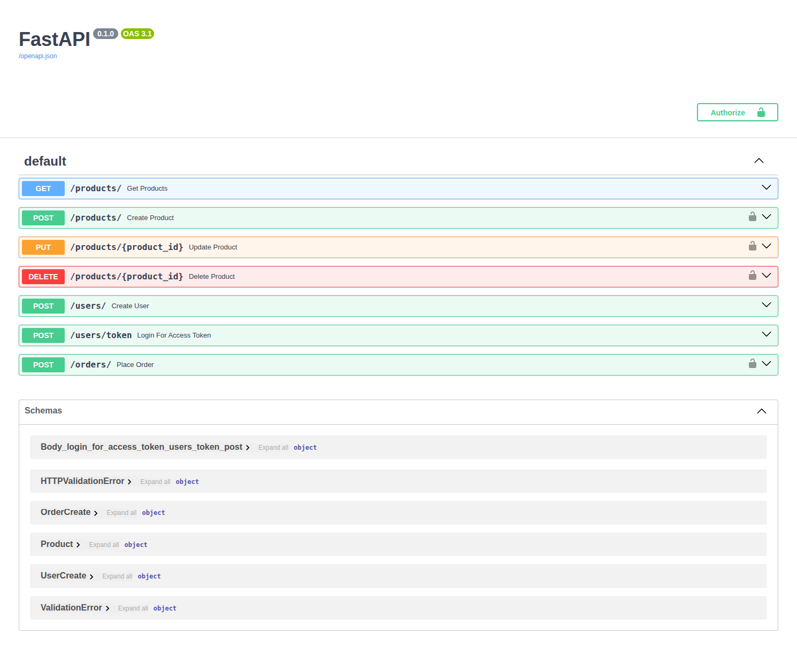

# FastAPI E-commerce API



This is a simple e-commerce API built with FastAPI.

## Features

*   Create, read, update, and delete products.
*   Create and manage users.
*   Place and view orders.
*   User authentication with JWT.

## Getting Started

1.  Install the dependencies:

    ```bash
    pip install -r requirements.txt
    ```

2.  Run the application:

    ```bash
    uvicorn app.main:app --reload
    ```

3.  Access the API documentation at [http://localhost:8000/docs](http://localhost:8000/docs).

## User Authentication

This application uses JSON Web Tokens (JWT) for user authentication. To access protected endpoints, you must first obtain a token by providing a valid username and password to the `/users/token` endpoint. The token must then be included in the `Authorization` header of your requests as a Bearer token.

**Example:**

```
Authorization: Bearer <your_token>
```

The following endpoints are protected:

*   `POST /products/`
*   `PUT /products/{product_id}`
*   `DELETE /products/{product_id}`
*   `POST /orders/`
*   `GET /users/me`
